# Scale4j

[](https://github.com/amenski/Scale4j/actions/workflows/build.yml)
[](https://central.sonatype.com/artifact/io.github.amenski/scale4j-core)
[](LICENSE)
[](https://adoptium.net/)

**Scale4j** is a modern image processing library for Java 17+. Resize, crop, rotate, filter, pad, and watermark images with a clean, fluent API.

## Why Scale4j

Java's image tooling hasn't kept up with the language: raw AWT is verbose, and the popular wrappers predate Java 8. Most projects end up hand-rolling the same `Graphics2D` boilerplate — and rediscovering the same traps. Scale4j packs that know-how into a small, dependency-light fluent API for modern Java, with correct-by-default handling of the classics that bite everyone: aspect ratios, EXIF orientation, and quality/speed trade-offs.

## How it compares

What Scale4j brings that plain Java 2D and the older wrappers don't:

- **EXIF orientation done right** — `loadWithMetadata().autoRotate()` handles all 8 orientation cases, resets the tag, and keeps the rest of the metadata (camera info, GPS) on save
- **An explicit quality ladder** — `LOW` → `ULTRA`, with progressive downscaling handled internally so big reductions don't turn to mush
- **Text and image watermarks, filters, arbitrary-angle rotation, per-side padding** — one fluent chain instead of five utilities
- **Parallel batch and async APIs** — `Scale4j.batch().parallel(n)`, `Scale4j.async()` with `CompletableFuture`
- **A Spring Boot starter** — auto-configured `Scale4jTemplate` with `scale4j.*` properties

Honest flip side: Scale4j requires **Java 17+** and brings two dependencies (slf4j-api and TwelveMonkeys ImageIO — the latter is what gives it solid JPEG/CMYK/TIFF handling). If you're on Java 8, use Thumbnailator.

Full feature matrix and benchmarks: [docs/COMPARISON.md](docs/COMPARISON.md)

| Original | Grayscale | Sepia | Edge Detect | Blur |
|---|---|---|---|---|
|  | 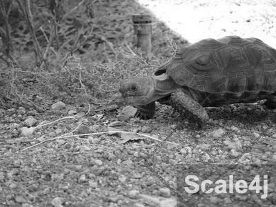 | 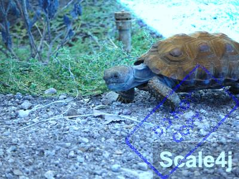 | 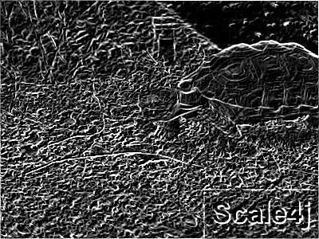 | 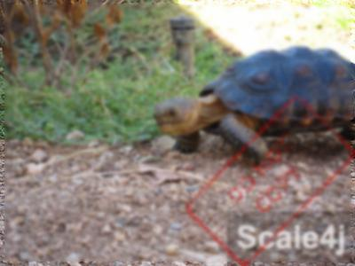 |

## Quick Start

```java
// straight to disk
Scale4j.load(image)
    .resize(300, 200)
    .toFile(Paths.get("output.jpg"), "jpg");

// or keep working with the result
BufferedImage result = Scale4j.load(image)
    .resize(300, 200)
    .build();
```

## Installation

### Maven

```xml
<dependency>
    <groupId>io.github.amenski</groupId>
    <artifactId>scale4j-core</artifactId>
    <version>1.0.0</version>
</dependency>
```

### Gradle

```groovy
implementation 'io.github.amenski:scale4j-core:1.0.0'
```

### Bill of Materials

```xml
<dependencyManagement>
    <dependencies>
        <dependency>
            <groupId>io.github.amenski</groupId>
            <artifactId>scale4j-bom</artifactId>
            <version>1.0.0</version>
            <type>pom</type>
            <scope>import</scope>
        </dependency>
    </dependencies>
</dependencyManagement>
```

### Spring Boot

Add the starter and configure defaults in `application.yml`:

```xml
<dependency>
    <groupId>io.github.amenski</groupId>
    <artifactId>scale4j-ext-spring-boot</artifactId>
    <version>1.0.0</version>
</dependency>
```

```yaml
# application.yml
scale4j:
  default-quality: HIGH
  default-mode: FIT
  async:
    threads: 8
```

Then inject `Scale4jTemplate` instead of calling `Scale4j.load()` directly:

```java
@Autowired
private Scale4jTemplate scale4j;

BufferedImage result = scale4j.load(image)
    .resize(300, 200)
    .build();
```

The template bakes in your configured defaults. You can still override them per-call with `.mode(...)` or `.quality(...)` on the returned builder.

### Build from Source

```bash
git clone https://github.com/amenski/scale4j.git
cd scale4j
mvn clean verify
```

## Features

### Thumbnails

The most common use case — downsize an image to a maximum dimension while preserving aspect ratio.

```java
Scale4j.load(image)
    .resize(150, 150, ResizeMode.FIT)
    .quality(ResizeQuality.HIGH)
    .toFile(Paths.get("thumb.jpg"), "jpg");
```

Use `FIT` mode to never exceed the target bounds, or `FILL` to crop to an exact square.

### Resize

Four modes control how the image fits the target dimensions. Four quality levels trade speed for fidelity.

```java
Scale4j.load(image)
    .resize(200, 200, ResizeMode.FIT)
    .quality(ResizeQuality.HIGH)
    .build();
```

| FIT (preserves aspect ratio) | FILL (fills target, may crop) |
|---|---|
|  | 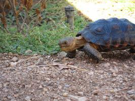 |

### Crop

Extract a rectangular region.

```java
Scale4j.load(image)
    .crop(100, 75, 200, 150)
    .build();
```


*Center-cropped 200x150 region from the original.*

### Rotate

Rotate by any angle in degrees. Empty corners fill with the specified background color.

```java
Scale4j.load(image)
    .rotate(45, Color.WHITE)
    .build();
```

| 90 degrees | 45 degrees |
|---|---|
| 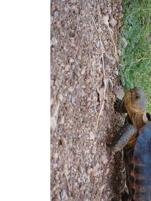 | 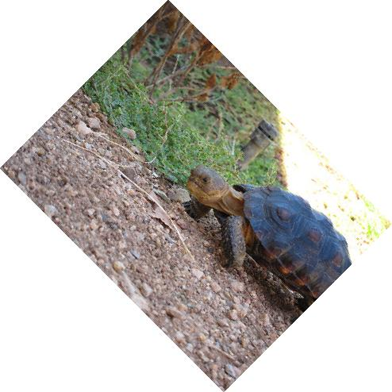 |

### Pad

Add a border around the image. Supports uniform or per-side padding with any color.

```java
Scale4j.load(image)
    .pad(20, Color.WHITE)
    .build();
```

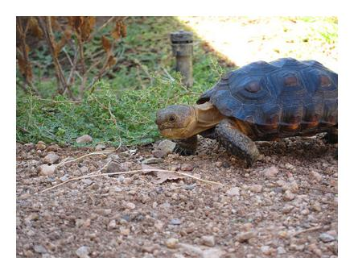

### Watermark

Add text or image watermarks with configurable position, opacity, font, and background.

```java
Scale4j.load(image)
    .watermark(TextWatermark.builder()
        .text("Scale4j")
        .font("Arial", Font.BOLD, 36)
        .opacity(0.7f)
        .position(WatermarkPosition.BOTTOM_RIGHT)
        .build())
    .build();
```

| Text Watermark | Image Watermark |
|---|---|
| 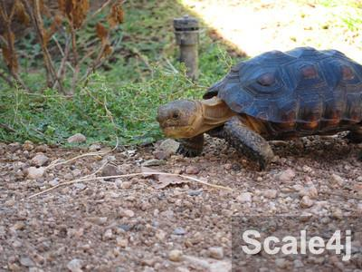 |  |

### Filters

Apply creative and corrective filters with a single method call.

```java
Scale4j.load(image)
    .grayscale()
    .sepia(0.8f)
    .blur(5f)
    .sharpen()
    .edgeDetect()
    .vignette(0.7f)
    .invert()
    .build();
```

| Original | Grayscale | Sepia | Blur | Sharpen |
|---|---|---|---|---|
|  |  |  |  | 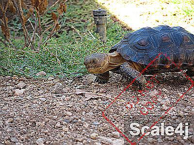 |

| Edge Detect | Vignette | Invert | Brightness | Contrast |
|---|---|---|---|---|
|  | 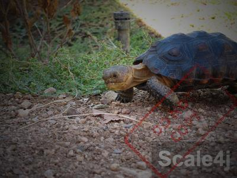 | 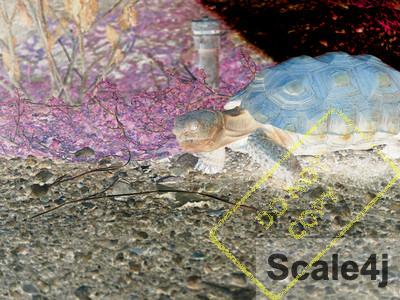 | 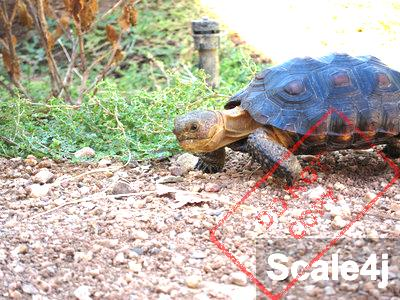 | 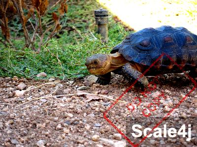 |

### Flip & Flop

Mirror the image horizontally or vertically.

```java
Scale4j.load(image).flip().build();  // horizontal mirror
Scale4j.load(image).flop().build();  // vertical mirror
```

| Flip | Flop |
|---|---|
| 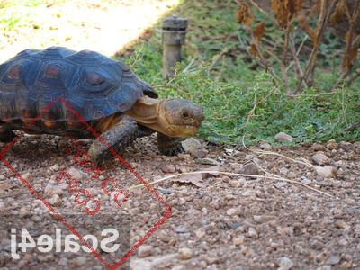 | 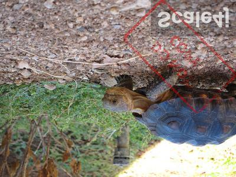 |

### Chained Operations

Combine any sequence of operations in a single fluent chain.

```java
Scale4j.load(image)
    .resize(300, 225, ResizeMode.FIT)
    .crop(25, 25, 250, 175)
    .rotate(90)
    .pad(15, Color.WHITE)
    .watermark(TextWatermark.builder()
        .text("Scale4j")
        .font("Arial", Font.BOLD, 28)
        .opacity(0.7f)
        .position(WatermarkPosition.BOTTOM_RIGHT)
        .build())
    .build();
```

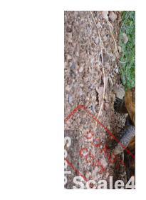

## Advanced Features

### Asynchronous Processing

Leverages virtual threads (Java 21+) or work-stealing pools for non-blocking execution.

```java
CompletableFuture<BufferedImage> future = Scale4j.async()
    .load(image)
    .resize(300, 200)
    .automatic()
    .medium()
    .apply();

BufferedImage result = future.join();
```

### Batch Processing

Process multiple images in parallel with configurable thread count.

```java
List<BufferedImage> results = Scale4j.batch()
    .images(images)
    .resize(100, 50)
    .parallel(4)
    .execute();
```

### EXIF Auto-Rotate

Automatically correct orientation using embedded EXIF metadata.

```java
Scale4j.loadWithMetadata(file)
    .autoRotate()
    .toFile(output, "jpg");
```

## Performance

Scale4j uses a **scratch buffer** technique to reduce GC pressure during chained operations. When multiple intermediate images share the same dimensions, a single `BufferedImage` is reused across the chain -- eliminating unnecessary allocations without any configuration.

## Contributing

Contributions are welcome. See [Code of Conduct](CODE_OF_CONDUCT.md) and the [Roadmap](ROADMAP.md).

## License

Apache License, Version 2.0. See [LICENSE](LICENSE).
